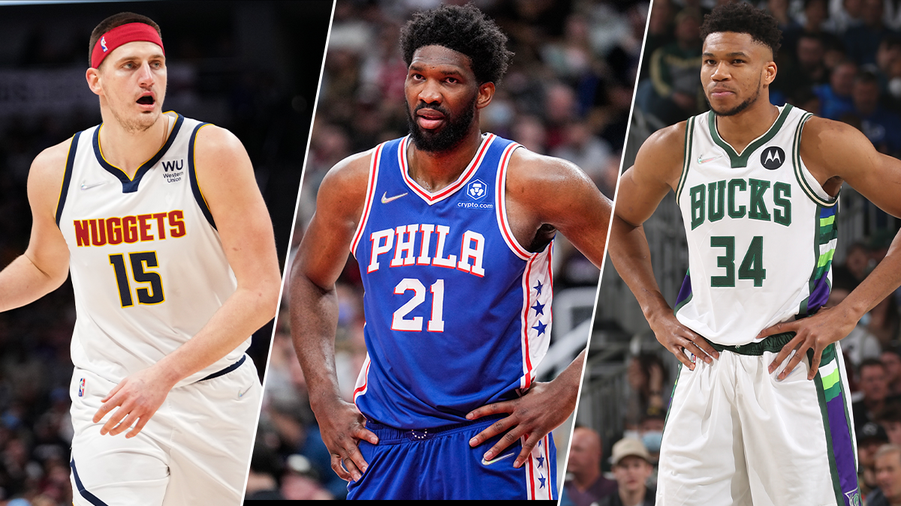
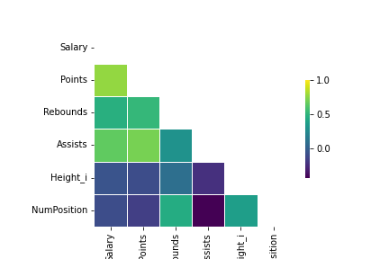
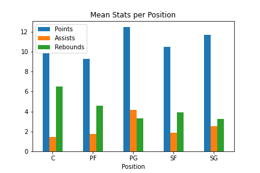
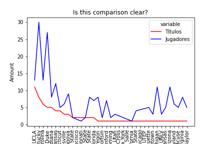
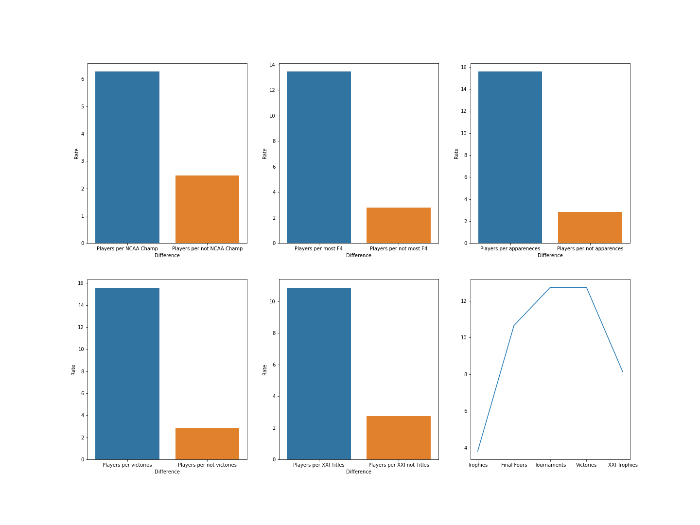
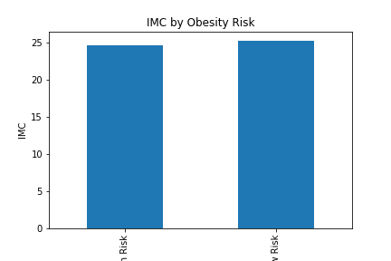
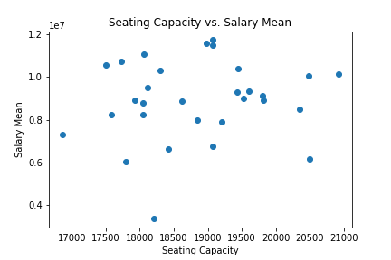
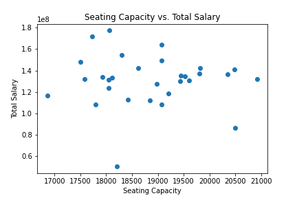

# Project-2-NBA

For this project, I wanted to learn more about one of my passions: NBA, so I get a CSV from Kaggle with the information of last season (2021-2022) of all the players involved in the league. I noticed that one of the columns was related with the college they were when they were drafted, so my aim was to do web-scrapping to see if there was a correlation between the college and the probability of suceeding in the basketball world. 

STEP 1: Cleaning
From the 558 samples, and the 12 columns of information, some of it is unnecesary, redundant or not correctly well expressed. The first thing to do was to filter the Position of the players in the field, as there are just 5 positions and some confusing values were mixed: I searched the correct position of the players with the positions "Forward" and "Guard", as the right positions are Point Guard, Shooting Guard, Small Forward, Power Forward and Center. 

Once the Position column was cleared and based in just 5 values, I dropped the repeated height column and checked if there was any player name repeated(is the only category were is not supposed to be any row with the same value, the rest may or may not). Charlie Brown Jr. (I really do not know who is this guy) was repeated, and as all the stats excepts the index were the same, i dropped one of the repeated rows. 

Then I create a new column with the Position of the fields, but with numeric values, to help me get more quantitative information. 

STEP 2: "Playing" with the CSV

For this step, I did not take into consideration the web scrapping; I just wanted to take some information about the CSV itself. So I set some questions in form of "Hypothesis 0":

H0.1 Scavenger Hunt: Will it be possible to find the MVP Award candidates of that year just looking at the basic stats? The final candidates were the players Joel Embiid, Nikola Jokic and Giannis Antetokounmpo
H0.2 Let's find the wealth correlation: Who wins more money in the NBA?
H0.3 Are the tall players the best playing basketball?

For the first group of hypothesis, we must drop the nan values of the columns with quantitative values, as they will be needed for the correlations and else. 

Just looking at the total stats and receiving the maximum of "Points", "Assists" and "Rebounds" we were not lucky, as not a single of the MVP candidates were present in the Top categories! But maybe we will be more lucky if we divide the data by Position of the Field. So splitting the Dataset by the column "Position", we were able to find "absolute" data that support the candidates to win the MVP Trophy! Nikola Jokic was the Center with most assists, Joel Embiid was the Center with most points and Giannis Antetokounmpo was the Power Forward with both most points and rebounds!

Now is time to find the correlation between the salary and the rest of the quantitative variables:

Looking at the table above, there are some correlations that must be pointed out: The salary has an obvious positive correlation with Points, Rebounds and Assists (as if you play better, you win more money) but looking at this 3 stats it seems that the less valued stat is the Rebound, as it is the less correlated. On the other hand, both Height and Position (strongly correlated between them) have a negative correlation: That means that the shortest players (Point Guards and Shooting Guards) that are top scorers and priorize assisting before rebounding will have the best NBA contracts!

Lastly, let's take a look at the tall players; as we have already seen, the tall players use to play in a position close to the rim (Centers or Power Forwards). I will sort by position and find the mean of the top stats to compare each position:

Just as in the last correlation table we found out that the salaries of the "big men" were less than the small guys; that might be related with data, as apart from getting more rebounds, both Centers and Power Forwards are the Position with less scoring points and less assists, the other two categories. 
Although the easy way of taking down this data will be to consider that more "role players" are big men, just consider that the Centers are the Position with less players in the season, and Power Forward were the 3rd! So if there is a lot of big men role players, for sure there will be much more that cover the rest of the positions.

HYPOTHESIS 1: Playing Basketball in colleges with NCAA Trophies is the best way of arriving to the NBA

I did some web scrapping to find a Wikipedia Page about College Basketball Stats; my first guess is that the more Trophies the college, more nba players will be active in the NBA. So first of all I must drop all the NAN values of the column "College", as i am not interested in players that came by another way to the NBA. 

This graph is a total mess: Although it seems pretty correlated that the "Top" Universities has more active players than the Colleges with less Trophies, the variability is really high. In addition, we are just analyzing the 36 colleges with at least 1 trophie... but in the NBA there are active players from more than 130 colleges! It is practically impossible and really confusing to try to put it in one big graph and observing the 2 lines converge or diverge... So I changed a bit my point of view. What if I compare the players/college rate depending on boolean factors? In that way, I can stablish the type of college that has an attribute that, in case another college do not have it, will be a big added value if you want to make it to the NBA. 

I set 5 different boolean factors: 

1. The college has won at least a Trophy vs NO
2. The college has appeared a lot in the Final Four vs NO
3. The college has played in a lot of Tournaments vs NO
4. The college has gained a lot of matches in Tournaments vs NO
5. The college has won at least a Trophy in XXI Century vs NO

Let's find the results

Contrary as predicted, the colleges with more College Tournaments played and more victories has the highest active player rate. This is because the national repercussion of the NCAA, even if you don't win, can open a lot of doors to play in the big league!

HYPOTHESIS 2: Calculating the IMC depending on the city and the Salaries per capacity of the stadium

Also with web scrapping, I saw that in my original database there were both Weight and Height, perfect for calculating the IMC! so I found a database with connects each team with a city, and searched the cities with most obesity rate to try to stablish a comparison between this cities and the players that live in it. On the other hand, as the new table had a "Seating Capacity" column, I tried to observe if there is a link between the capacity of the stadium and the salaries of the players (more spectators means more money)

So... Yeah, it has nothing to do the Obesity rate with the player's IMC. Moreover, in the cities with lest Obesity Rate, the IMC of the players is higher!

Let's see if we are more lucky with the correlation between the capacity of the stadiums and the mean salary per player:

After observing this scatterplot, I just didn't see any relation between the mean of the Salaries per Team depending on the Seating Capacity of the Stadium. Then I realized that maybe there were some teams that hire more players with less money (10 days contract or dual contracts, or just keep firing players in the mid season), so the mean of this teams will change drastically and gets extremely lower that the teams that are with the same players during the whole season, so I decided to try to see if the relation between the Seating Capacity and the Total Salary (total Salaries of all the team members) exist:

Still a total mess...

In conclusion:

The hypothesis 0 reflected some obvious results (such as the position correlation with height, or the scavenger's hunt) and other that were quite amazing, such as the "big guys" being less scorers or the "little guys" being more payed.

The first hypothesis also reflected some interesting conclusions, as it seems that even that if you went to a college with more titles in this century is important to make the talent hunters take an eye on you, is more important the national repercussion of your university, reflected in the total times your team has played and the amount of victories over the years.

The second hypothesis's results were bad: The IMC of the players does not depend on the obseity percentage of the city they are playing, neither the salaries depend on the Stadium capacity of each team. 